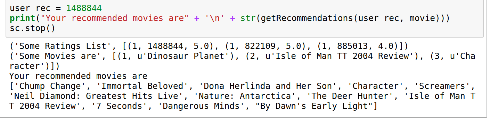
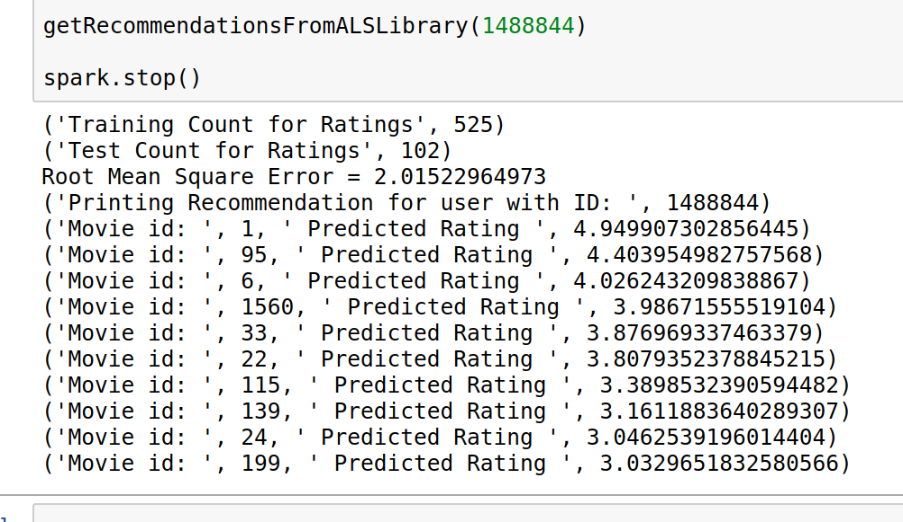

## Cloud Computing for Data Analysis: Movie Recommendation System

#### Authors:

* Aditya Gupta (agupta42@uncc.edu) 
* Rekhansh Panchal (rpanchal@uncc.edu)

Group 11

***

#### Overview:

* The project aims to analyze and extract insights from the Netflix data using the concepts of Cloud Computing.
* The goal of the project is to implement Pearson Correlation Coefficient & Alternating Least Squares algorithms with the help of PySpark.
* Movie Recommendations is implemented using Collaborative Filtering using pySpark on Netflix Data.
* This project’s primary aim is to provide movie recommendations to the user based on their
preferences.

#### Tasks Involved and Steps Implemented:

* Configuring Jupyter Notebook and Spark
* Understanding the problem statement
* Understanding the algorithm
* Fetching the data
* Data cleaning
* Implementing PCS, ALS, and ALS with Library on Local Machine.
* Deploying the code and data on Amazon Web Services.
* Output generation
* Project Report

#### Approach:

* Need to fill something here.

#### Motivation:

* Most of the online shopping is due to the personalised recommendations to users, reminding them about an item.
* It not only shows user interest but also helps the user to keep a price track of the items.
* This handy feature urged us to learn to technique of recommendation and algorithms behind it.
* Movie recommendation system is not something out-of-box project, infact, it has been already implemented by people. However, we considered this, more of a learning project and went with the movie recommendation option.

***
#### What is Collaborative Filtering:
Collaborative Filtering is a method of making automatic predictions (filtering) about the interests of a user by collecting preferences or taste information from similar users.

***

#### Data:
The original movie rating files contain over 100 million ratings from 480 thousand randomly-chosen, anonymous Netflix customers over 17 thousand movie titles. 

The data were collected between October, 1998 and December, 2005 and reflect the distribution of all ratings received during this period. The ratings are on a scale from 1 to 5 (integral) stars. 

However, use have worked on a part of the complete data for the project.

Number of Users: 750
Number of Movies: 1,000
Number of Ratings: 4,20,000

Input Ratings Data File contains: movie_id, user_id, ratings, date_of_rating
Input Movie Title file cotains: movie_id, year_of_release, movie_title

***

#### Data Link:
[Movie Rating Files](https://www.kaggle.com/netflix-inc/netflix-prize-data/data)

***

#### Algorithm:
1. Pearson Correlation Coefficient

Tell how it works.

2. Alternative Least Squares

Tell how it works.

***

#### External Tools

* Amazon S3 for storage of data and program.
* Amazon EC2 (Spark 2.2.0) for running the program on cluster.
* Git for tracking the code changes.
* GitHub for hosting the website.

#### Expectations
##### 1. What to expect?

* One can expect the implementation of both the algorithms and a proper documentation of outcomes of this project, which is the movie recommendations for users.

##### 2. Likely to accomplish

* Result comparison and Performance Evaluation with respect to existing implementation of algorithms and project implementation.
* Documentation and online-publishing of the codebase.

##### 3. Ideal Accomplishments.

* Suggested modifications/changes in the existing or project implementation.
* Creating a easy to use library that one can use for analysis purpose.

***

#### Tools Used:
* Jupyter Notebook
* pySpark
* Git and GitHub
* Amazon S3 and EC2

***

#### README

* Add all program files to the Amazon Storage S3 along with the reduced dataset of ratings.
* Create a Spark Cluster on Amazon EC2 and get the details of the cluster to use it on Terminal.

* Confirm Connection to the Cluster with obtained keypair.
~~~~
ssh -i ~/keypair.pem -ND 8157 hadoop@ec2-34-238-246-242.compute-1.amazonaws.com
~~~~

* Start Cluster Access
~~~~
ssh -i keypair.pem hadoop@ec2-34-238-246-242.compute-1.amazonaws.com
~~~~

* Import Pandas on the cluster:
~~~~
sudo pip install pandas
~~~~

* Run PCSalgorithm on input data consisting 4,20,000 ratings stored on S3 Storage. To recommend movies for user 1199825.
~~~~
spark-submit s3://itcs6190/PCSalgorithm.py s3://itcs6190/movie_input_ratings.txt s3://itcs6190/movie_titles.csv 1199825
~~~~

* Run ALS on input data consisting 4,20,000 ratings stored on S3 Storage. To recommend movies for user 1199825.
~~~~
spark-submit s3://itcs6190/ALS.py s3://itcs6190/movie_input_ratings.txt s3://itcs6190/movie_titles.csv 1199825
~~~~

* Run ALS using library for recommend movies for all users
~~~~
spark-submit s3://itcs6190/ALSUsingLibrary.py s3://itcs6190/movie_input_ratings.txt
~~~~

***

#### Outputs for User ID: 1488844

* Pearson Correlation Coefficient implementation.

* ALS implementation.

* ALS from ml Recommendation.

***

#### Results:

The programs to recommend were ran on Amazon EC2 Spark cluster. And satisfactory recommendations were obtained using 3 methods.
* Using Pearson Correlation ( User - User )
* Using ALS implementation 
* Using ALS library from mllib ( User - User )

***

#### Conclusion:

- [x] Created a User - User based recommendation system using ALS and Pearson Correlation Coefficient techniques.

- [x] Displayed top movies recommended a user by taking userId as input.

***

#### Future Scope:

* Recommend movies to new user and predict ratings for the same.
* Creating a easy to use library that one can use for analysis purpose. 

***

#### Code Snippet:

* Data Cleaning

* Pearson Calculation

***

#### Challenges Faced:

* We started with implementing Singular Value Decomposition technique, but couldn't achieve anything potential with that due to multiple missing rating entries. Thus, we implemented ALS and ALS using ML library.
* Had no prior experience on implementing the code on PySpark, so had a lot of minor issues while handling the data.
* The data available, is huge to be considered, hence we had to limit it down to a lower scale.
* Hadoop DSBA Cluster was non-funcitonal during our 

***

#### Work Division:

The complete project has been accomplished together with inputs from both the team members. 

| Number  | Task                  | Contribution      |
| ------- |:---------------------:| -----------------:|
| 1       | Pearson Correlation   |            Aditya |
| 2       | ALS Implementation    |          Rekhansh |
| 3       | ALS Using Library     |          Rekhansh |
| 4       | Cluter and Deployment | Aditya & Rekhansh |
| 5       | Project Report        | Aditya & Rekhansh |

***

#### References:
* Recommender Systems: https://www.youtube.com/playlist?list=PL_npY1DYXHPT-3dorG7Em6d18P4JRFDvH
* Pearson Correlation: http://www.statisticshowto.com/probability-and-statistics/correlation-coefficient-formula/
* ALS: Large-scale Parallel Collaborative Filtering for the Netflix Prize: http://www.grappa.univ-lille3.fr/~mary/cours/stats/centrale/reco/paper/MatrixFactorizationALS.pdf

